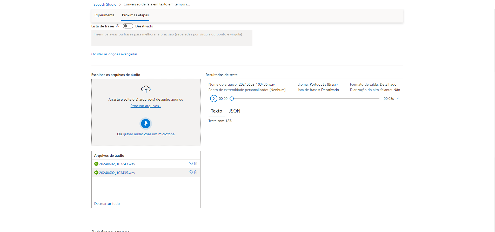
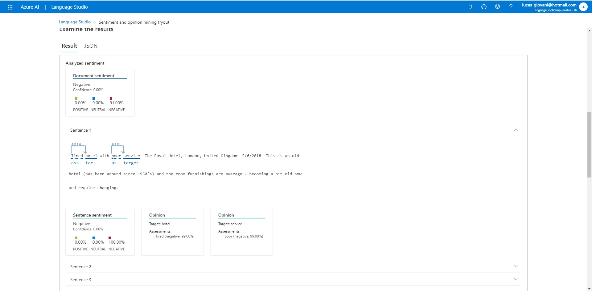

# Laboratorio3Dio

## Conversão de fala em texto em tempo real
- Primeiro vamos acessar o portal do [Speech Studio](https://speech.microsoft.com).
- Associaremos ou criaremos um novo recurso para ser usado.
- Em seguida iremos selecionar a opção "Conversão de fala em texto em tempo real"

## O Language Studio
- Primeiro vamos criar o recurso de "Analise de texto" no [Portal do Azure](https://portal.azure.com)
- Após a criação de recurso, iremos acessar o portal do [Language Studio](https://language.cognitive.azure.com)
- Associaremos ou criaremos um novo recurso para ser usado.
- Em seguida selecionar a aba "Classify Text"
- E selecionar a opção "Analyze sentiment and opinions"
- 
